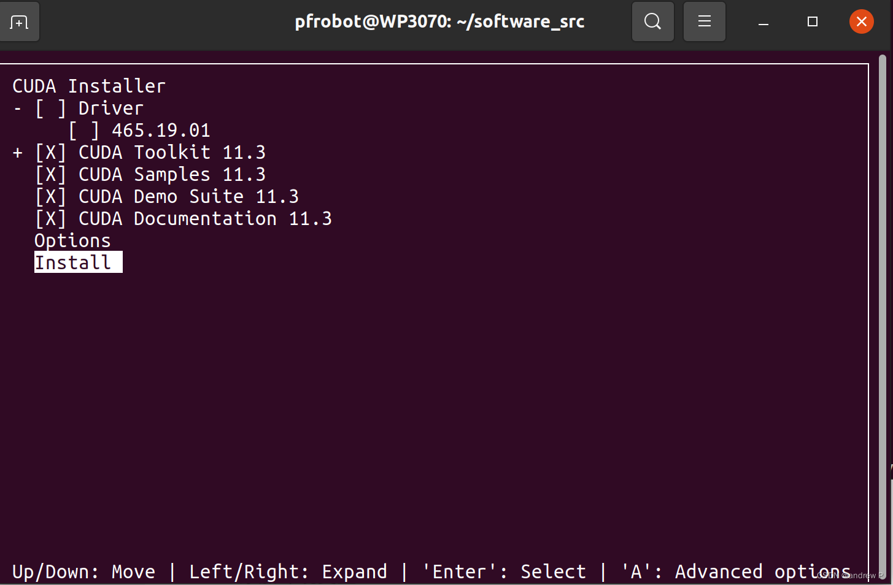
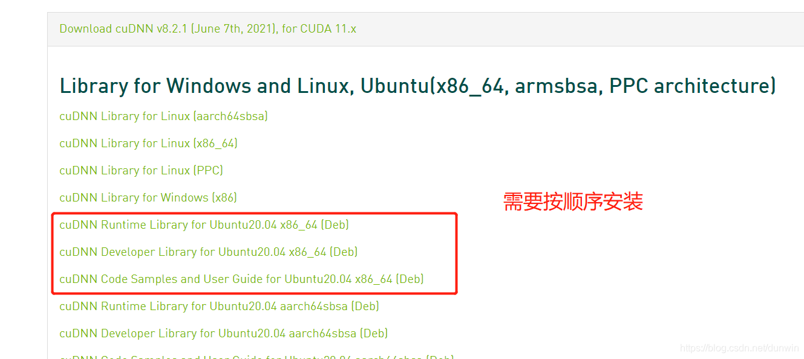

# 运行环境

- ubuntu20.04

- ROS noetic

- cuda-11.3

- cudnn-8.2.1

- tensorRT-8.5.3.1

- Anaconda3-2021.05 -- python 3.8.10(ubuntu20.04自带)

- Pytorch-1.10.0


# 环境配置

## 一、 Anaconda3 + Pycharm(可选)

### Anaconda3

1. 下载Anaconda3

在[清华镜像源](https://mirrors.bfsu.edu.cn/anaconda/archive/)选择“Anaconda3-2021.05-Linux-x86_64.sh“安装

2. 安装
```
bash Anaconda3-2022.10-Linux-x86_64.sh
```

输入yes，并按回车键，一直到协议阅读结束，然后剩下的一直都是“输入yes，并按回车键”

3. 查看是否安装成功
```
conda --version
```

如果找不到命令，就添加一下环境变量
```
gedit ~/.bashrc
```

添加以下内容：export PATH="/home/用户名/anaconda3/bin:$PATH"
```
source ~/.bashrc
```

### Pycharm

1. 下载Pycharm

进入Pycharm[官网](https://www.jetbrains.com/pycharm/download/?section=linux)

可以下载专业版(Professional)-用学校邮箱注册一个学生账号就可以免费使用；当然，下载社区版也可以( Community)

Pycharm专业版增加了Web开发、Python Web框架、Python分析器、远程开发、支持数据库与SQL等更多高级功能

2. 创建桌面图标

启动Pycharm
```
cd pycharm-2023.3.4/bin
./pycharm.sh
```

在启动页面点击Configure(不同版本不一样，2023.3.4版本在左下角齿轮)，选中Create Desktop Entry，并在弹出的对话框中勾选for all users即可生成快捷方式

3. 安装汉化插件

点击左侧plugin，搜索chinese，选择“Chinese(Simplified)Language Pack”安装，然后重启Pycharm


## 二、Openpcdet配置：cuda 11.3 + cuDNN 8.2.1 + Pytorch1.10.0 + torchvision0.11.0 + torchaudio0.10.0

### cuda 11.3

1. 安装显卡驱动

查看当前显卡驱动：
```
dpkg -l | grep nvidia
```

如果没有安装nvidia的显卡驱动，需要先安装，**但是如果已经安装，千万不要卸载，重装推荐版本！！**
```
ubuntu-drivers devices              # ubuntu检测可选驱动
sudo apt install nvidia-driver-510  # 根据自己的可选驱动下载显卡驱动
```

2. 安装cuda 11.3

**为什么要手动安装cuda？**

以前在windows上写代码的时候，要安装显卡驱动、cudatoolkit和cDNN；到了Ubuntu上，只用安装驱动，因为pytorch上可以安装自带的cuda库，但是在跑别人的代码的时候，别人自己指定了要利用c++结合cuda来计算，不用pytorch，那么cuda库就用不了，因为cuda库在pytorch中，只好手动安装，否则**一直找不到CUDA_HOME这个环境变量**

选择和自己电脑对应的版本号：


会生成一个安装命令，执行：
```
wget https://developer.download.nvidia.com/compute/cuda/12.4.0/local_installers/cuda_12.4.0_550.54.14_linux.run
sudo sh cuda_12.4.0_550.54.14_linux.run
```

取消cuda自带的驱动：


3. 添加环境变量：
```
gedit ~/.bashrc
#添加以下内容：
export CUDA_HOME=/usr/local/cuda-11.3
export LD_LIBRARY_PATH=${CUDA_HOME}/lib64
export PATH=${CUDA_HOME}/bin:${PATH}
```

4. 测试是否安装成功：
```
nvcc -V
```

5. 卸载命令：
```
# cuda10.1及以上的卸载
cd /usr/local/cuda-xx.x/bin/
sudo ./cuda-uninstaller
sudo rm -rf /usr/local/cuda-xx.x
```

### cuDNN 8.2.1

1. 安装cuDNN 8.2.1

进入[官网](https://developer.nvidia.com/rdp/cudnn-archive)


按顺序安装，因为有依赖关系：
```
sudo dpkg -i libcudnn8_8.2.1.32-1+cuda11.3_amd64.deb
sudo dpkg -i libcudnn8_8.2.1.32-1+cuda11.3_amd64.deb
sudo dpkg -i libcudnn8-samples_8.2.1.32-1+cuda11.3_amd64.deb
```

2. 测试是否安装成功：
```
cp -r /usr/src/cudnn_samples_v8/ $HOME      # 将cuDNN例子复制到可写路径中
​
cd  ~/cudnn_samples_v8/mnistCUDNN           # 转到可写路径
​
sudo make clean                             # 编译文件
sudo make
​
sudo ./mnistCUDNN                           # 运行样例程序
```

如果报错显示缺少库(缺少#include "FreeImage.h)，就安装依赖：
```
sudo apt-get install libfreeimage3 libfreeimage-dev
```

### 安装Oenpcdet的环境

1. 创建虚拟环境
```
conda create -n dear_dlo python=3.8
```

激活虚拟环境
```
conda activate dear_dlo
```

2. 安装Pytorch1.10.0 + torchvision0.11.0 + torchaudio0.10.0
```
pip install torch==1.10.0+cu113 torchvision==0.11.0+cu113 torchaudio==0.10.0 -f https://download.pytorch.org/whl/torch_stable.html
conda install cudatoolkit=11.3

#以清华源为例，下载的时候会报错，因为cudatoolkit=11.3的版本在清华源上是没有的。尝试用北外的源下载11.3版本的cudatoolkit。
conda install cudatoolkit=11.3 -c https://mirrors.bfsu.edu.cn/anaconda/cloud/conda-forge
```

测试Pytorch是否可用：
```
python
import torch as t
device = t.device('cuda' if t.cuda.is_available() else 'cpu')
print(device) 
```

如果不是cuda请检查pytorch是否安装为cpu版本

3. 安装spconv:
```
pip install spconv-cu113 -i https://pypi.tuna.tsinghua.edu.cn/simple
```

验证spconv是否可用:
```
import spconv.pytorch as spconv
```

4. 下载安装Openpcdet

**建议直接将其下载到虚拟环境中(~/anaconda3/envs/dear_dlo)**
```
~/anaconda3/envs/dear_dlo
git clone https://github.com/open-mmlab/OpenPCDet.git
cd OpenPCDet
pip install -r requirements.txt 
sudo python setup.py develop
```

测试是否可用：
```
cd tools
python demo.py --cfg_file cfgs/kitti_models/pv_rcnn.yaml     --ckpt pointpillar_7728.pth     --data_path 000000.bin
```


==**到此为止，PointPillars和Center-PointPillars的python版本应该都可以使用了，接下来是TensorRT版本的部署，因为我要把它们嵌入到dlo中**==


## 三、tensorRT-8.5.3.1

1. 安装tensorRT-8.5.3.1

进入[官网](https://developer.nvidia.com/nvidia-tensorrt-8x-download)

选择“TensorRT 8.5 GA Update 2 for Linux x86_64 and CUDA 11.0, 11.1, 11.2, 11.3, 11.4, 11.5, 11.6, 11.7 and 11.8 TAR Package”下载

下载完成后是一个名字为“TensorRT-8.5.3.1.Linux.x86_64-gnu.cuda-11.8.cudnn8.6.tar.gz”的压缩包

解压：
```
tar zxvf TensorRT-8.5.3.1.Linux.x86_64-gnu.cuda-11.8.cudnn8.6.tar.gz
```

添加环境：
```
gedit ~/.bashrc
# 添加以下内容
# tensorrt environment
export LD_LIBRARY_PATH=$LD_LIBRARY_PATH:/home/jyp/3rdparty/TensorRT-8.5.3.1/lib # TensorRT-8.5.3.1/lib前面一长串是你的安装路径
export CPATH=/home/jyp/3rdparty/TensorRT-8.5.3.1/include:$CPATH                 # TensorRT-8.5.3.1/include前面一长串是你的安装路径
```

2. 附带软件安装

把附带的软件装了，不然使用时可能会报错：

以python为例：
```
cd TensorRT-8.5.3.1/python
pip install tensorrt-8.5.3.1-cp38-none-linux_x86_64.whl # 选择对应版本的python
```

其他：
```
# 安装 pyyaml scikit-image onnx onnx-simplifier
pip install pyyaml scikit-image onnx onnx-simplifier 

# 安装onnx-graphsurgeon
pip install onnx_graphsurgeon --index-url https://pypi.ngc.nvidia.com
```

查看onnx相关环境:
```
pip list | grep onnx
```

显示如下:
onnx                          1.14.0
onnx-graphsurgeon             0.3.27
onnx-simplifier               0.4.33
onnxruntime                   1.15.1


# Center_Pointpillars TensorRT部署

1. 下载Lidar_AI_Solution(内包含Cneter_Pointpillars源码)

```
git clone --recursive https://github.com/NVIDIA-AI-IOT/Lidar_AI_Solution.git
```

2. 修改配置文件
```
cd Lidar_AI_Solution/CUDA-CenterPoint
gedit tools/build.trt.sh
```

在大概23行的位置添加以下内容：
```
# TensorRT-8.5.3.1路径
export PATH=/home/jyp/3rdparty/TensorRT-8.5.3.1/bin:$PATH
export LD_LIBRARY_PATH=/home/jyp/3rdparty/TensorRT-8.5.3.1/lib:$LD_LIBRARY_PATH
export LIBRARY_PATH=/home/jyp/3rdparty/TensorRT-8.5.3.1/lib:$LIBRARY_PATH

# cuda路径, 按照自己的修改
export CUDA_Lib=/usr/local/cuda-11.3/lib64
export CUDA_Inc=/usr/local/cuda-11.3/include
export CUDA_Bin=/usr/local/cuda-11.3/bin
export CUDA_HOME=/usr/local/cuda-11.3

#cudnn路径， 安装cuda已经将cudnn的lib64放入了cuda/lib64里面
export CUDNN_Lib=/usr/local/cuda-11.3/lib64


trt_version=8513
```

另外还有：
```
# if 语句中运行trtexec可执行文件改成绝对路径, 
# 这句trtexec运行作用是在使用TensorRT-8.5.3.1/bin/下trtexec程序生成engine文件
# 需要在CUDA-CenterPoint目录运行tool/build.trt.sh， 不能在tool运行build.trt.sh
# 应该修改的绝对路径如下：
/home/jyp/3rdparty/TensorRT-8.5.3.1/bin/trtexec
```

**但是实际我没修改也成功了，可能是配置了TensorRT的环境变量自动识别到了**

3. 运行转换脚本
```
bash tool/build.trt.sh
# 终端显示如下，转换的时候时间比较长，如果1-2秒就结束了，代表没转换成功, 可以看看前面的修改正确吗
# 转换后会在model文件夹中生成3个新文件。
Building the model: model/rpn_centerhead_sim.plan.8531, this will take 2 minutes. Wait a moment 🤗🤗🤗~.
```

运行后tool/build.trt.sh，在./model路径下，总共5个文件：

原本有centerpoint.scn.onnx与rpn_centerhead_sim.onnx两个onnx文件，生成一个rpn_centerhead_sim.plan和2个log文件，目录如下：
```
model
  ├── centerpoint.scn.onnx
  ├── rpn_centerhead_sim.8531.log
  ├── rpn_centerhead_sim.onnx
  ├── rpn_centerhead_sim.plan -> ...
  └── rpn_centerhead_sim.plan.8531
```

4. 编译
```
mkdir -p build && cd build
cmake .. && make -j
```

5. 运行
```
cd build
./centerpoint ../data/test/ --verbose
```

出现以下结果表示成功：
```
<<<<<<<<<<<
load file: ../data/test/291e7331922541cea98122b607d24831.bin
find points num: 239911
[TIME] Voxelization:            0.12720 ms
valid_num: 85179
[TIME] 3D Backbone:             2.22150 ms
[TIME] RPN + Head:              1.49750 ms
[TIME] Decode + NMS:            2.27770 ms
Detection NUM: 194
Saved prediction in: ../data/prediction/291e7331922541cea98122b607d24831.txt
```

# ROS noetic安装

1. 添加ROS软件源
```
sudo sh -c '. /etc/lsb-release && echo "deb http://mirrors.ustc.edu.cn/ros/ubuntu/ $DISTRIB_CODENAME main" > /etc/apt/sources.list.d/ros-latest.list'
```

2. 添加密钥
```
sudo apt-key adv --keyserver 'hkp://keyserver.ubuntu.com:80' --recv-key C1CF6E31E6BADE8868B172B4F42ED6FBAB17C654
```

3. 更新软甲源
```
sudo apt update
```

4. 安装ROS
```
sudo apt install ros-noetic-desktop-full
```

5. 初始化rosdep
```
sudo apt-get install python3-pip
sudo pip install rosdepc
sudo rosdepc init
rosdepc update
```

6. 配置环境变量
```
echo "source /opt/ros/noetic/setup.bash" >> ~/.bashrc
source ~/.bashrc
```

7. 安装rosinstall
```
sudo apt install python3-rosinstall python3-rosinstall-generator python3-wstool
```

8. 检查是否安装成功
```
roscore
rosrun turtlesim turtlesim_node
rosrun turtlesim turtle_teleop_key
```


==**至此全部环境已经配置完毕！可以编译功能包了！**==

# 运行dear_dlo

```
cd dear_dlo_ws
catkin_make
sourse devel/setup.bash
roslaunch dear_dlo dear_dlo.launch
```


